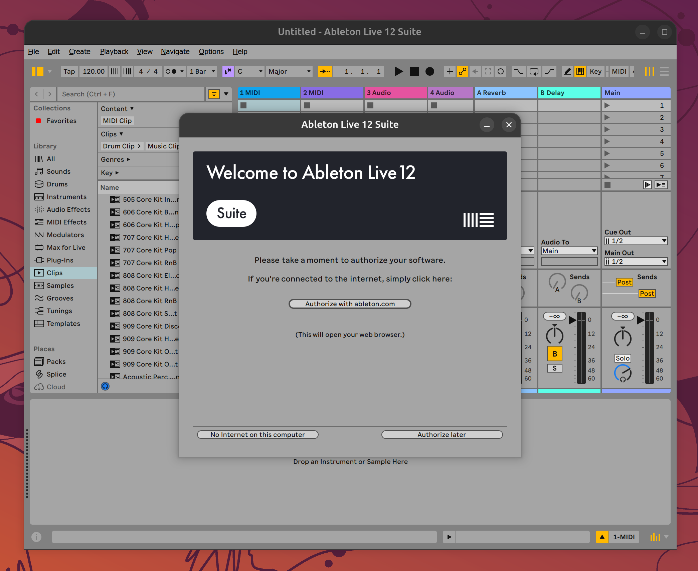
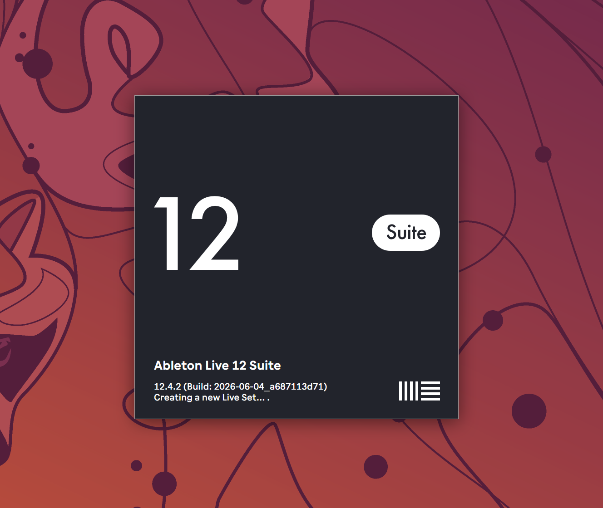
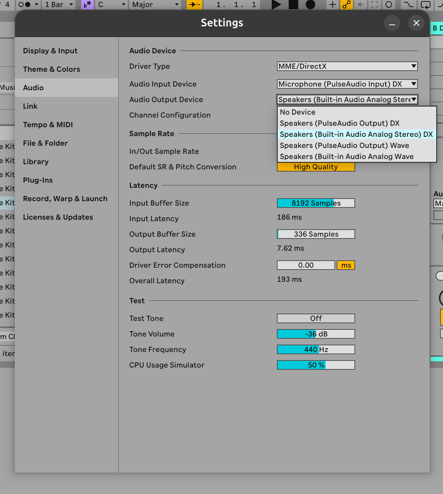

<p align="center">
  <picture>
    <source srcset="assets/branding/encore-logo.svg" type="image/svg+xml">
    
  </picture>
</p>

<h1 align="center">ENCORE</h1>

ENCORE is a guided Wine compatibility setup for running Ableton Live 12 Suite on Linux. It is maintained by `wowitsjack` and focuses on making the difficult parts, including building the patched Wine tree, configuring HiDPI, native file access, VST3 hosting, audio, drag-and-drop, themed menus, and Learn View, approachable from one command.

> [!WARNING]
> ENCORE is experimental and is not affiliated with Ableton or Wine. Back up important Live Sets and prefixes before testing it.

<p align="center">
  
</p>

<p align="center">
  
  
</p>

## Quick start

Download or clone ENCORE, open a terminal in its folder, and run:

```sh
./install.sh
```

The installer is an interactive setup wizard. It:

- detects Ubuntu/Debian, Fedora, Arch Linux, and CachyOS package systems;
- checks the desktop, session, CPU, memory, disk space, and existing ENCORE setup;
- finds likely Ableton Live 12 installer files or lets you drag one into the terminal;
- explains and recommends display scaling instead of silently forcing a DPI;
- offers quiet, balanced, and fast Wine build modes;
- shows the exact system package command before asking for sudo;
- resumes safe completed work when rerun after a cancellation or failure;
- installs the application-menu entry and optionally launches Live;
- optionally offers authenticated GitHub CLI users a final chance to star ENCORE; pressing Enter accepts, and unauthenticated users are never prompted.

Do **not** run the whole script with `sudo`. ENCORE asks for sudo only if you approve installation of missing system packages.

Ableton Live, its installer, a Wine prefix, and compiled binaries are not included. Supply your own licensed Ableton Live 12 Suite installer.

## Supported systems

- x86-64 Linux.
- Ubuntu and Debian through `apt`.
- Fedora through `dnf`/`dnf5`.
- Arch Linux and CachyOS through `pacman`.
- A Wayland session with Xwayland available is recommended.

GNOME on Wayland is the best-tested desktop. The package setup supports KDE and other desktops, including their portal backends, but ENCORE's window-management compatibility work is still experimental there.

On Arch and CachyOS, approving dependency installation runs `pacman -Syu` because partial upgrades are unsupported. The wizard shows the command before invoking sudo.

The first build needs roughly 15–25 GiB of free space. It can take a while and use substantial CPU. Choose **Quiet** in the wizard if heat or fan noise matters more than build speed.

## Display scaling

The wizard recommends a value from the current desktop and monitor when it can. You always get the final choice:

| Desktop scale | Wine DPI |
| --- | ---: |
| 100% | 96 |
| 125% | 120 |
| 150% | 144 |
| 175% | 168 |
| 200% | 192 |
| 250% | 240 |

For mixed-DPI monitors, choose the scale of the monitor where Ableton normally opens. You can rerun `./install.sh --no-build` later to change it safely.

## Existing installations and retries

If the selected prefix already contains Ableton, the wizard offers to reuse it. If the matching ENCORE Wine build is complete, it is reused as well. Partial Wine compilation resumes through Make; the installer never deletes a dirty Wine checkout, an unrelated prefix, or completed downloads.

Once setup begins, detailed logs are stored under `logs/`. A failure reports the stage, log path, and safely quoted retry command. Fix the stated problem and rerun it; completed safe stages are retained. If an installer was supplied but Ableton is already present, ENCORE reuses it instead of reinstalling unless `--reinstall-ableton` is explicit.

Live must be closed while ENCORE changes the prefix. In interactive mode the wizard waits for you to close it. It never kills Live or injects remote input.

## Automation and advanced paths

Run `./install.sh --help` for every option. A fully specified unattended install looks like:

```sh
./install.sh --non-interactive --yes --install-deps \
  --installer "/path/to/Ableton Live 12 Suite Installer.exe" \
  --scale 200 --jobs 2 --no-launch
```

Useful alternatives:

```sh
./install.sh --dry-run
./install.sh --build-only --install-deps --jobs 4
./install.sh --no-build --dpi 96
./install.sh --prefix "$HOME/Music/Ableton Prefix"
```

ENCORE refuses to modify a non-empty prefix it does not recognize. Inspect the folder first, then pass `--adopt-prefix` only when you deliberately want ENCORE to own it.

The wizard remembers the selected prefix, Wine, and Ableton paths in `.encore/runtime.conf`, so later installer runs and the bare launcher keep working with custom locations and with `--no-desktop`. Environment variables and command-line options override those saved choices. The launcher understands:

- `ENCORE_PREFIX`: Wine prefix; defaults to `ableton-prefix`.
- `ENCORE_WINE`: existing ENCORE Wine executable.
- `ENCORE_ABLETON`: Ableton executable path inside the prefix.
- `ENCORE_CPU_TOPOLOGY`: runtime CPU topology override. The default is selected from the Linux affinity/cpuset and capped at eight logical CPUs.
- `ENCORE_WEBVIEW2_FLAGS`: complete WebView2 flag override. Set it to an empty value to disable launcher-supplied flags.

Live's **Settings > Plug-ins > VST3 Custom Folder > Browse** control uses the native desktop folder picker. ENCORE exposes the selected host path to Live and its plug-in scanner, including folders outside your home directory and folders on mounted drives. No symlink or VST path variable is required.

## Known limitations

- GNOME/Wayland/Xwayland is the primary tested window-management path; other desktops remain experimental.
- WebView2 currently requires `--no-sandbox` under this Wine build, weakening isolation for the remote Learn View page.
- DirectComposition is disabled; Learn View uses SwiftShader and CPU compositing.
- ENCORE builds Wine locally and does not provide prebuilt binaries or an Ableton installer.

## Bug reports and next steps

We love bug reports. ENCORE covers an unusual mix of Wine, desktop integration, audio, plug-ins, graphics, and hardware, so real-world reports are one of the best ways to make it better. If something breaks, [open a GitHub issue](https://github.com/wowitsjack/ENCORE/issues) with your Linux distribution, desktop/session, GPU, the steps that trigger the problem, and the relevant ENCORE log. Please remove personal information and do not upload Ableton installers, Live content, or other licensed files.

The next areas of development are:

- Ableton Push support, including reliable discovery and communication with Push hardware;
- broader USB and MIDI setup, permissions, and hot-plug handling across supported distributions;
- continued compatibility work for plug-ins, WebView2, graphics, audio, and non-GNOME desktops.

## Licensing and bundled material

ENCORE does not redistribute Ableton software. `patches/encore-wine.patch` is a source delta against the pinned upstream Wine revision and remains subject to the applicable upstream file licenses.

The installer does not ship a replacement font binary. It creates a prefix-local Arial-compatible fallback from the user's installed Liberation Sans, retains the source font's license records, and records the source hash in the generated font metadata.
