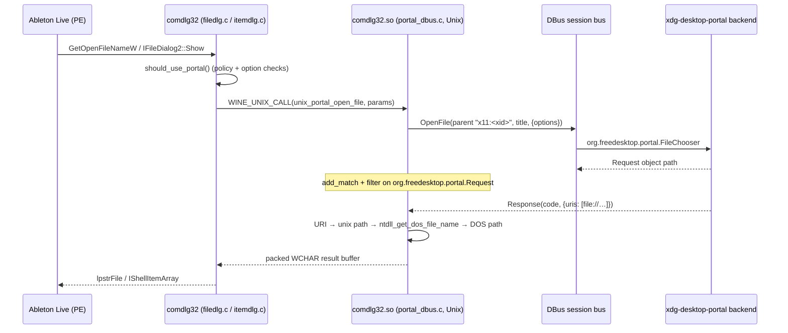

# Native file picker via xdg-desktop-portal (comdlg32)

The flagship feature of the ENCORE patch (~2,800 patch lines): Wine's common
file dialogs are replaced, when appropriate, by the **host desktop's own file
chooser** through `org.freedesktop.portal.FileChooser`.

## Problem

Ableton Live's **Settings ▸ Plug-Ins ▸ VST3 Custom Folder ▸ Browse** (and every
other open/save dialog) normally gets Wine's built-in dialog, which is awkward
on a modern desktop and makes it hard to reach folders outside the prefix —
other drives, mounts, folders outside `$HOME`. Live also needs the *scanner* to
see whatever path the user picked. A native GTK/KDE picker via the portal fixes
both: familiar UI, full host filesystem, and the chosen host path is translated
back into a Wine path Live can use directly — no symlinks or VST-path variables.

## What the patch does

Adds a Unix library to comdlg32 (`comdlg32.so`) that speaks DBus to the desktop
portal, and hooks it into **both** dialog APIs:

- the legacy `GetOpenFileNameW/A` and `GetSaveFileNameW/A` path
  (`dlls/comdlg32/filedlg.c`), and
- the modern Vista-style `IFileDialog2::Show` / `GetResult` path
  (`dlls/comdlg32/itemdlg.c`) — the one Live actually uses.

### The DBus client (`portal_dbus.c`, new, +1193)

- `dlopen`s `SONAME_LIBDBUS_1` (fallback literal `"libdbus-1.so.3"`) at runtime
  and resolves every `dbus_*` symbol into a `p_dbus_*` pointer table — no
  hard link-time dependency on libdbus.
- `portal_call_and_wait()` builds the method call to
  `org.freedesktop.portal.Desktop` at `/org/freedesktop/portal/desktop`,
  interface `org.freedesktop.portal.FileChooser`, method `OpenFile` or
  `SaveFile`. Options dict entries it populates:
  `handle_token` (`wine<pid>_<seq>`), `multiple`, `directory`,
  `current_folder` (as an `ay` byte array), `current_name` and `current_file`
  (save only), `filters` (`a(sa(us))`, glob type 0) and `current_filter`.
- The initial call uses an **infinite DBus timeout** (`-1`), deliberately: if
  the call timed out while a slow backend was still creating the dialog, Wine
  would fall back to its own dialog and the user would see two.
- It then adds a match rule + filter for the **`Response` signal on
  `org.freedesktop.portal.Request`** at the returned request path and pumps
  `dbus_connection_read_write_dispatch` until the response arrives.
  Response code 0 → `STATUS_SUCCESS`, 1 → `STATUS_CANCELLED`,
  anything else → `STATUS_INTERNAL_ERROR`.
- `portal_response_filter()` tolerates several result shapes: `uris` as `as`,
  a single `uri`/`current_file` string, or `ay` byte arrays.

### Path mapping back into Wine

`uri_to_win32_path()` strips `file://`, URL-decodes `%XX` escapes, and calls
`ntdll_get_dos_file_name()` — Wine's canonical Unix→DOS conversion, which walks
the prefix's `dosdevices` drive symlinks. This is why
`scripts/configure-prefix.sh` guarantees a host-root drive (e.g. `Z:` → `/`):
with it, *any* host path the portal returns maps to a valid DOS path, including
mounted drives and folders outside `$HOME`. For save dialogs the target may not
exist yet, so the conversion runs with `FILE_OPEN_IF` and tolerates
`STATUS_NO_SUCH_FILE`.

### The PE/Unix boundary (`unixlib.c` / `unixlib.h`)

Fixed-size parameter blocks cross the boundary
(`PORTAL_PATH_MAX`/`PORTAL_STR_MAX` 4096, `PORTAL_FILTERS_MAX` 8192,
`PORTAL_RESULT_MAX` 65536 WCHARs), with three functions:
`unix_portal_open_file`, `unix_portal_save_file`, `unix_portal_is_available`.
Multi-select results are packed either **grouped** (directory, then filenames —
the classic `OPENFILENAMEW` multi-select layout) when all files share one
directory, or as full NUL-separated paths otherwise; `result_grouped` tells the
PE side which. Overflow reports `STATUS_BUFFER_TOO_SMALL` plus the required
length, which `filedlg.c` translates into the documented
`FNERR_BUFFERTOOSMALL` protocol (required size written as a WORD into
`lpstrFile`).

### Dialog parenting

`COMDLG32_GetPortalParentXid()` (`cdlg32.c`) finds the owner's top-level window
and reads the `__wine_x11_whole_window` window property to get the X11 XID,
passed to the portal as `"x11:<hex>"` so the picker parents/centres correctly.
If the property is unavailable (for example, the window has not been mapped
through X11 yet), the parent string is left empty and the dialog opens
unparented — a cosmetic limitation only.

## Policy: when the portal is used

`get_portal_policy()` decides per dialog:

1. `WINE_FORCE_PORTAL=1` (environment) → **force**.
2. Registry `FileDialogPortal` = `always` / `never` / `auto`, read via the new
   `include/wine/appdefaults.h` helper `wine_get_appdefaults_reg_sz()`, which
   checks `HKCU\Software\Wine\AppDefaults\<exe>\X11 Driver` first, then the
   global `HKCU\Software\Wine\X11 Driver`.
3. Unset/`auto` → use the portal only when the dialog is compatible.

In `auto` mode the portal is skipped when the app customises the dialog:
legacy dialogs with `OFN_ENABLEHOOK`/`OFN_ENABLETEMPLATE(HANDLE)` or without
`OFN_EXPLORER`; item dialogs with unsupported `FOS_*` options, custom controls,
or any registered event sink. (When the portal path does run, it still fires
`OnFileOk`, so applications observe the selection.) ENCORE's `configure-prefix.sh`
sets `FileDialogPortal=always` **only for the imported Live executable** (the
Live 11/12 edition installed in the prefix, e.g. `Ableton Live 12 Suite.exe`) via
AppDefaults, leaving other apps in the prefix on `auto`.

## Fallback and cancel behaviour

- Portal unavailable (no libdbus, no session bus, no backend) →
  `STATUS_NOT_SUPPORTED` → silently fall through to Wine's built-in dialog.
- User cancels → `STATUS_CANCELLED` → the API returns FALSE /
  `HRESULT_FROM_WIN32(ERROR_CANCELLED)` with **no** fallback dialog.
- In `itemdlg.c`, results become an `IShellItemArray` via `SHParseDisplayName`;
  for save paths that don't exist it escalates through
  `SHCreateItemFromParsingName` → `ILCreateFromPathW` → *last resort*: create a
  temporary placeholder file (`FILE_ATTRIBUTE_TEMPORARY |
  FILE_FLAG_DELETE_ON_CLOSE`) just long enough for `SHParseDisplayName` to
  succeed, without leaving user-visible files. The chosen path is also cached
  (`portal_result_path`) so `GetResult` can answer even if shell-item
  construction failed.

## Key files

| File | Role |
| --- | --- |
| `dlls/comdlg32/portal_dbus.c` | Unix-side DBus client (new) |
| `dlls/comdlg32/unixlib.c` / `unixlib.h` | Unix entry table + shared param structs (new) |
| `dlls/comdlg32/filedlg.c` | Legacy `GetOpen/SaveFileNameW/A` integration |
| `dlls/comdlg32/itemdlg.c` | `IFileDialog2` integration |
| `dlls/comdlg32/cdlg32.c` / `cdlg.h` | unixlib init, parent-XID helper |
| `include/wine/appdefaults.h` | AppDefaults registry reader (new) |
| `dlls/comdlg32/Makefile.in` | `UNIXLIB = comdlg32.so`, DBus CFLAGS |

## Runtime toggles

| Knob | Values | Effect |
| --- | --- | --- |
| `FileDialogPortal` (registry, `X11 Driver` section) | `always` / `never` / `auto` (default) | Per-app or global policy; installer sets `always` for Live. |
| `WINE_FORCE_PORTAL` | `1` | Force the portal regardless of registry policy. |

## Caveats

- Filter patterns are passed as globs; a `*.adg;*.adv`-style multi-pattern
  filter is split on `;`.
- The open/save marshalling helpers are duplicated between `filedlg.c` and
  `itemdlg.c` (copy-pasted, not shared) — a refactor target.
- Parenting is X11/Xwayland-specific (XID-based).

## How to verify

Inside the prefix, open Live's VST3 folder browser — you should get the GTK/KDE
portal picker and be able to select any host folder; the selected path must then
appear in Live and be scannable. For a quick negative test, run with
`WINEDEBUG=+commdlg` and `FileDialogPortal=never` to confirm fallback to the
Wine dialog. `scripts/install-dependencies.sh --check runtime` verifies a
FileChooser portal backend is installed.
