# VST3 plugin windows & HiDPI config-rounding (win32u + winex11.drv)

Three window-management features share this subsystem: special-casing of VST3
plug-in editor windows, a state machine that keeps HiDPI window geometry
stable under Xwayland, and a gate that keeps the WM from double-decorating
Live's custom-non-client main window. Its companion patch,
[windowing-nspa.md](windowing-nspa.md) (`31`), suppresses the reentrant
`WM_WINDOWPOSCHANGED` resize loop.

## Part 1 — VST3 plugin window handling

### Problem

Live hosts VST3 editors in top-level windows of class **`Vst3PlugWindow`**.
Out of the box these come up as `WS_EX_TOOLWINDOW` tool windows (no proper
title bar under many WMs), inherit a fixed DPI context (blurry or mis-scaled
plug-in GUIs on HiDPI), and after a resize the plug-in's client area often
isn't repainted (garbled UI). Live's own main window can also be shrunk below
a usable size by WM interactions.

### What the patch does

All behaviour keys off the window class name, checked in two places:
`is_vst3_plugin_window_name()` (`dlls/win32u/window.c`, compares the
`UNICODE_STRING` at creation) and `is_vst3_plugin_window()`
(`dlls/winex11.drv/window.c`, via `NtUserGetClassName` on the `GA_ROOT`
ancestor). Each toggle is an environment variable read with `env_enabled()`
(set and defaulted to `1` by `scripts/run-ableton.sh`):

- **`ENCORE_NATIVE_VST3_DECORATIONS`** — strips `WS_EX_TOOLWINDOW` from VST3
  windows at creation (`create_window_handle`, `NtUserCreateWindowEx`) and when
  computing MWM hints (`get_mwm_decorations_for_window`,
  `X11DRV_GetWindowStyleMasks`), so the WM gives plug-in editors normal
  decorations: title bar, move, close.
- **`ENCORE_NATIVE_VST3_DPI`** — forces the window's DPI context to
  `NTUSER_DPI_PER_MONITOR_AWARE` at creation, so plug-in editors scale with the
  monitor they are on instead of inheriting Live's process context.
- **`ENCORE_VST3_RESIZE_REPAINT`** — in `X11DRV_MoveWindowBits`, when a VST3
  window (or child) changes client size, skips the copy-bits fast path and
  issues `NtUserRedrawWindow(RDW_INVALIDATE | RDW_ERASE | RDW_ALLCHILDREN)` so
  the plug-in GUI fully redraws.
- **`ENCORE_X11_MIN_VISIBLE_SIZE`** (default `800x643`) —
  `set_configured_min_size_hint()` parses `WxH` (strictly: `%ux%u` with no
  trailing junk, 1–65535) and publishes an X11 `PMinSize` hint, scaled to the
  window's DPI, for resizable, non-owned top-level windows. This stops the WM
  shrinking Live below a usable layout.

## Part 2 — HiDPI config-rounding state machine

### Problem

At 200% scaling, Wine works in logical coordinates while the X server works in
physical pixels. When Wine requests a window geometry, the window manager may
legally answer with a rect rounded by up to one scale unit. Upstream Wine feeds
that rounded rect back to the Win32 side as a *new* size, Live responds by
re-requesting its geometry, the WM rounds again — a feedback loop that shows up
as windows jittering, drifting, or snapping a pixel smaller on every move.

### What the patch does

`dlls/winex11.drv/window.c` (+~300 lines) tracks each configure request and
recognises WM rounding as an **alias** of the rect Wine asked for, rather than
a real change. New fields live in `struct x11drv_win_data` (`x11drv.h`):
`config_generation`, `config_rounding_{state,serial,settle_serial,generation}`,
and the `config_rounding_win32_rect` / `config_rounding_host_rect` pair.

```mermaid
stateDiagram-v2
    [*] --> NONE
    NONE --> PENDING : window_set_config() sends a position/size request
    PENDING --> ACKED : ConfigureNotify matches the requested rect exactly
    PENDING --> ACTIVE : ConfigureNotify differs only by integer-DPI rounding
    PENDING --> NONE : unrelated geometry arrives
    ACKED --> ACTIVE : late rounding within the settle window
    ACKED --> NONE : unrelated geometry, or settle window passes
    ACTIVE --> ACTIVE : same host rect re-confirmed, or WM title-bar drag
    ACTIVE --> NONE : real change (config_generation++) or window destroyed
```

Key mechanics:

- `config_matches_dpi_rounding()` accepts a host rect as "rounding" only at
  integer scale factors, only when every edge differs by less than one scale
  unit and lands on a multiple of the scale — anything else is a real change.
- While the alias is ACTIVE, `window_update_client_config()` **ignores** the
  rounded host rect (returns no update) so Win32 never sees it, and
  `sync_window_position()` **reuses** the acknowledged host rect when Wine
  re-requests the same Win32 rect — breaking the loop from both directions.
- Title-bar drags are pure host translations: `track_config_rounding_move()`
  detects a same-size move (both axes translated within one scale unit),
  shifts the remembered Win32 rect, and reports **move-only** updates
  (`SWP_NOSIZE`) so a drag never becomes a resize.
- A generation counter (`config_generation`, bumped in
  `X11DRV_WindowPosChanged` whenever the Win32 rect genuinely changes)
  guarantees a later application resize can never be mistaken for stale
  rounding; `destroy_whole_window` clears everything.
- The ACKED state has a **settle window**
  (`get_config_rounding_settle_serial()` extends it past other pending WM
  requests) because some WMs acknowledge exactly and then round a moment later.

### Related DPI fix in `win32u/message.c`

`WM_WINE_WINDOW_STATE_CHANGED` handling now converts WM geometry raw→virtual
**inside the target window's DPI awareness context** and applies
`NtUserSetWindowPos` there, so coordinates cross the DPI boundary once instead
of being rounded through the message thread's (possibly different) context.

## Part 3 — custom-NC decoration gate

### Problem

Live's main window is **custom-non-client**: it `NCCALCSIZE`s its client area
to cover the whole window and draws its own title bar and window controls.
`get_mwm_decorations` already treats `window == visible` as "undecorated", but
that equivalence stops holding once the display scales — so at high DPI a
reparenting WM (Mutter, Marco) requests decorations and paints a **second**
frame and set of window controls around Live's own.

### What the patch does

`get_mwm_decorations` (`dlls/winex11.drv/window.c`) also returns no decorations
when `client == window` — the robust signal for an app-drawn-chrome top-level,
independent of scale. Ported from shibco/ableton-linux (NSPA 0004, LGPL — the
same license as Wine). It lives in this patch rather than beside its companion
(`31`) because both would otherwise edit the same function, which
`bootstrap-wine.sh`'s single `git apply --cached` invocation cannot stage.

## Key files

| File | Role |
| --- | --- |
| `dlls/winex11.drv/window.c` | VST3 decorations/min-size/repaint; the entire rounding state machine |
| `dlls/winex11.drv/x11drv.h` | rounding-state fields on `x11drv_win_data` |
| `dlls/win32u/window.c` | VST3 class detection at creation; DPI/exstyle overrides |
| `dlls/win32u/message.c` | DPI-context-correct WM geometry application |

## Runtime toggles

`ENCORE_NATIVE_VST3_DECORATIONS`, `ENCORE_NATIVE_VST3_DPI`,
`ENCORE_VST3_RESIZE_REPAINT`, `ENCORE_X11_MIN_VISIBLE_SIZE` — all default-on
via the launcher; see [../environment.md](../environment.md). The rounding
state machine has no toggle; it is inert at 100% scale by construction
(`dpi % USER_DEFAULT_SCREEN_DPI` guards).

## How to verify

On a 200% display: open a VST3 editor (title bar present, crisp at monitor
DPI, clean redraw after resizing); drag Live's main window by the title bar and
confirm the size never changes; watch `WINEDEBUG=+x11drv` for
`tracking config … request`, `activating config rounding alias`, and
`applying rounded config move … without resizing` traces. Live's main window
should refuse to shrink below the configured minimum visible size.

For the custom-NC gate: with the HiDPI matched-set applied (`LogPixels=192` +
IFEO `dpiAwareness=2`), Live's main window must show exactly **one** title bar
and one set of window controls — Live's own, with no WM frame around them.
